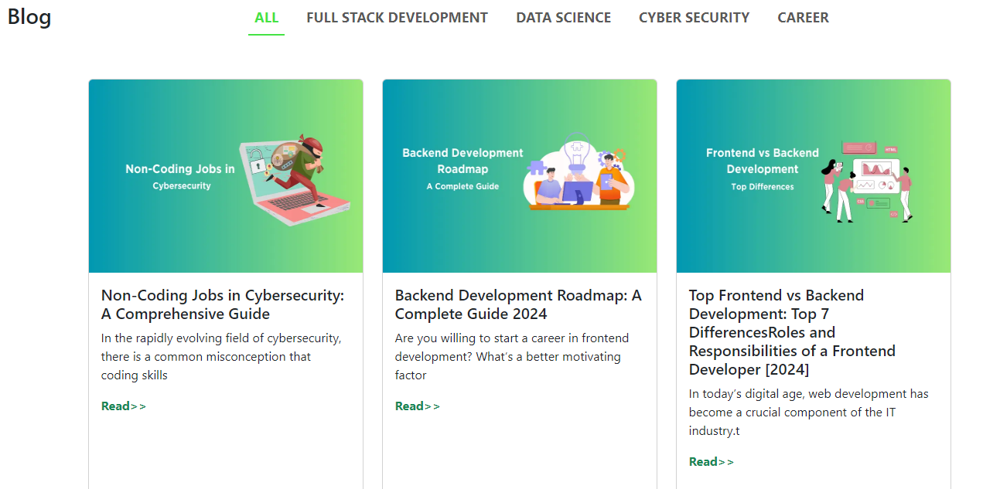

# React Blog application (React-router-dom)

 - This application routing components All, Data Science, Full stack development, Cyber Security, Career

 ## Table of Content
 - [Image Demo](#image-demo)
 - [Deployment](#deployment)
 - [Blog application router links](#blog-application-router-links)
 - [Application components](#application-components)
 - [File path tree](#file-path-tree)
 - [Contribution](#contribution)

 
## Image Demo
 
 
## Deployment
- [Click here check deployed URL]()

## Blog application router links

```
 - All                         --> display all blogs
 - Full Stack Development      --> filter and display FSD blogs
 - Data Science                --> filter and display Data science blogs
 - Cyber Security              --> filter and display Cyber security
 - Career                      --> filter and display Career
```
## Application components
 ```
 - App
 - NavBar.jsx
 - FullStackDevelopment.jsx
 - DataScience.jsx
 - CyberSecurity.jsx
 - Card.jsx
 - Career.jsx
 - All.jsx
 ```

## File path tree

 ```
+----_src
      +--assets
      +--_components
         +--css
         +-- All.jsx
         +-- Card.jsx
         +-- Career.jsx
         +-- CyberSecurity.jsx
         +-- DataScience.jsx
         +-- FullStackDevelopment.jsx
         +-- NavBar.jsx
      +--App.css
      +--App.jsx
      +--index.css
      +--main.jsx
+--.gitignore
+--index.html
+--package-lock.json
+--package.json
+--README.md
+--vite.config.js
 ```
## Contribution 
- Bug report, further developmention contribution are welcome
